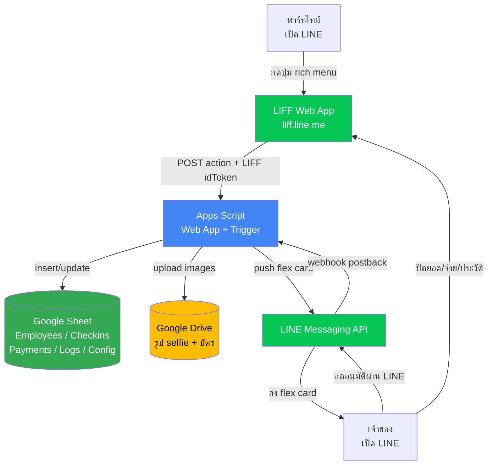

# Architecture — partime-checkin

> **Status:** Draft v1
> **สร้างเมื่อ:** 2026-05-09
> **อ่านก่อน:** [CONTEXT.md](../CONTEXT.md)

---

## 1. ภาพรวมระบบ

**Legend:**
- 🟢 Google Sheet = ฐานข้อมูลหลัก (5 sheet)
- 🟡 Google Drive = เก็บรูปทุกชนิด
- 🟦 Apps Script = brain ของระบบ (handle ทุก request)
- 🟢 LIFF / LINE = หน้าจอผู้ใช้ + ช่องส่งแจ้งเตือน

---

## 2. Data Flow — 4 flow หลัก

### Flow A: ลงทะเบียนครั้งแรก

| # | Step | ใครทำ | ข้อมูลที่ส่ง | ปลายทาง |
|---|------|-------|-----------|--------|
| 1 | กด rich menu "ลงทะเบียน" | พาร์ทไทม์ | — | เปิด LIFF |
| 2 | กรอกฟอร์ม + ถ่าย selfie + บัตร | พาร์ทไทม์ | ชื่อ, เบอร์, บัญชี, รูป 2 รูป + LIFF idToken | LIFF |
| 3 | submit | LIFF | JSON + base64 images + idToken | Apps Script `doPost` |
| 4 | validate + เช็ค `line_user_id` ซ้ำ | Apps Script | — | — |
| 5 | upload รูป | Apps Script | 2 รูป | Google Drive |
| 6 | insert row + gen `employee_id` | Apps Script | row | Sheet `Employees` |
| 7 | reply ok + push welcome | Apps Script | text | LINE → พาร์ทไทม์ |

### Flow B: เช็คอินรายวัน

| # | Step | ใครทำ | ข้อมูลที่ส่ง | ปลายทาง |
|---|------|-------|-----------|--------|
| 1 | กด rich menu "เช็คอิน" | พาร์ทไทม์ | — | เปิด LIFF |
| 2 | LIFF ขอ GPS + เปิดกล้องถ่าย selfie | LIFF | auto-detect slot 1-4 | — |
| 3 | submit | LIFF | lat, lng, selfie, slot + idToken | Apps Script |
| 4 | คำนวณ haversine vs `geofence_lat/lng` | Apps Script | — | — |
| 5 | ถ้าเกิน radius → บันทึกได้แต่ flag `has_out_of_range` | Apps Script | warning flag | Sheet |
| 6 | เช็ค duplicate slot เดิมในวันเดียวกัน | Apps Script | — | Sheet `Checkins` |
| 7 | upload selfie | Apps Script | รูป | Google Drive |
| 8 | update slot N + scan_count, status=`pending` | Apps Script | row | Sheet `Checkins` |
| 9 | push progress card หาเจ้าของทุก slot และ approval card เมื่อครบ 4 slot | Apps Script | flex JSON | LINE → เจ้าของ |

### Flow C: เจ้าของอนุมัติ

| # | Step | ใครทำ | ข้อมูล | ปลายทาง |
|---|------|-------|--------|--------|
| 1 | กดปุ่มใน flex (เต็ม/ครึ่ง/ไม่อนุมัติ) | เจ้าของ | postback `action=approve&id=CHK-...&type=full` | LINE webhook |
| 2 | webhook → Apps Script | LINE | postback data | Apps Script `doPost` |
| 3 | update Sheet `Checkins`: status, day_type, wage, approved_at | Apps Script | — | Sheet |
| 4 | reply confirm กลับเจ้าของ | Apps Script | text "อนุมัติเรียบร้อย" | LINE → เจ้าของ |

### Flow D: ดูยอด + ปิดยอด + จ่าย

| # | Step | ใครทำ | ข้อมูล | ปลายทาง |
|---|------|-------|--------|--------|
| 1 | พาร์ทไทม์เปิด LIFF "ดูยอด" | พาร์ทไทม์ | LINE userId | Apps Script |
| 2 | sum `wage` จาก `Checkins` ที่ status=approved เดือนปัจจุบัน | Apps Script | — | — |
| 3 | แสดงผล + รายการรอบที่แล้ว | Apps Script | JSON | LIFF |
| 4 | เจ้าของเปิด LIFF Owner และกดปิดยอด | เจ้าของ | employeeId, period, เงินพิเศษ, เงิน OT, note | Apps Script |
| 5 | ถ้ามี pending และยังไม่ confirm → block + แจ้งเตือน | Apps Script | error `has_pending` | LIFF |
| 6 | ถ้า employee+period เคยปิดแล้ว → block | Apps Script | error `payment_already_closed` | LIFF |
| 7 | สร้างแถว `Payments` status=`รอจ่าย` พร้อม breakdown | Apps Script | row | Sheet `Payments` |
| 8 | push แจ้งพาร์ทไทม์ว่า “ปิดยอดแล้ว / รอจ่าย” | Apps Script | text | LINE → พาร์ทไทม์ |
| 9 | เจ้าของกด `ทำเครื่องหมายจ่ายแล้ว` | เจ้าของ | paymentId | Apps Script |
| 10 | update `Payments` status=`จ่ายแล้ว`, `paid_at` และ push แจ้งพาร์ทไทม์ | Apps Script | row + text | Sheet + LINE |
| 11 | ถ้ากดผิด เจ้าของกด `แก้เป็นรอจ่าย` พร้อมเหตุผล | เจ้าของ | paymentId, reason | Apps Script + OwnerLogs |

---

## 3. Sheet Structure

ดู [CONTEXT.md § 4 Data Model](../CONTEXT.md#4-data-model)

---

## 4. Setup Plan (checklist ทำตามลำดับ)

- [ ] **Step 1:** สร้าง Google Sheet ใหม่ + 5 sheet ตาม CONTEXT § 4 (Employees / Checkins / Payments / Logs / Config)
- [ ] **Step 2:** สร้าง Google Drive folder ชื่อ `partime-checkin-images` + sub-folder `selfies` / `id-cards` / `daily-checkins`
- [ ] **Step 3:** สร้าง LINE Official Account + เปิด Messaging API + คัดลอก Channel Access Token
- [ ] **Step 4:** สร้าง LIFF app 3 endpoint: `/register`, `/checkin`, `/balance` + คัดลอก LIFF IDs
- [ ] **Step 5:** Extensions → Apps Script → ใส่โค้ดจาก TASKS.md
- [ ] **Step 6:** ตั้ง Script Properties: `SHEET_ID`, `DRIVE_FOLDER_ID`, `LINE_CHANNEL_ACCESS_TOKEN`, `OWNER_LINE_USER_ID`, `LIFF_ID_REGISTER`, `LIFF_ID_CHECKIN`, `LIFF_ID_BALANCE`
- [ ] **Step 7:** Deploy Apps Script เป็น Web App (Execute as: me, Access: Anyone) + คัดลอก URL
- [ ] **Step 8:** ตั้ง LINE webhook URL = Apps Script Web App URL
- [ ] **Step 9:** สร้าง rich menu 3 ปุ่ม: ลงทะเบียน / เช็คอิน / ดูยอด → link ไปแต่ละ LIFF
- [ ] **Step 10:** เพิ่มค่าใน Sheet `Config` (wage_full_day=400, wage_half_day=200, geofence_lat/lng/radius)
- [ ] **Step 11:** ทดสอบ Flow A (ลงทะเบียน) ด้วย dummy account
- [ ] **Step 12:** ทดสอบ Flow B (เช็คอิน) ใน-นอกรัศมี
- [ ] **Step 13:** ทดสอบ Flow C (อนุมัติทั้ง 3 ปุ่ม)
- [ ] **Step 14:** ทดสอบ Flow D (ปิดยอด + เงินพิเศษ/OT + จ่ายแล้ว + แก้กลับรอจ่าย)

---

## 5. Edge Cases

| สถานการณ์ | วิธีรับมือ | implement ที่ |
|---|---|---|
| LINE userId ลงทะเบียนซ้ำ | block + แจ้ง "คุณลงทะเบียนแล้ว" | Apps Script `register()` |
| GPS อยู่นอกรัศมี | reject + แจ้ง distance ที่อยู่ | Apps Script `checkin()` |
| ผู้ใช้ปิด GPS | LIFF แจ้ง "ต้องเปิด location" + ไม่ส่ง request | LIFF frontend |
| เช็คอินซ้ำวันเดียวกัน | ไม่สร้างแถวใหม่ + return แถวเดิม | Apps Script `checkin()` (เช็ค employee_id + checkin_date) |
| เจ้าของไม่กดอนุมัติ | row ค้าง `pending` ตลอด, นับยอดเฉพาะ approved | Apps Script `getBalance()` |
| ลาออกแล้ว LINE userId เดิมเช็คอินอีก | block ที่ `is_active=FALSE` | Apps Script `checkin()` |
| ปิดยอดแต่มี pending ค้าง | LIFF Owner เตือน "ยังมี X วัน pending" และต้องกดปิดแบบ confirm | Apps Script `closePeriod()` |
| ปิดยอดซ้ำ employee+period | block ด้วย `payment_already_closed` | Apps Script `closePeriod()` |
| owner กดจ่ายผิด | กด `แก้เป็นรอจ่าย` พร้อมเหตุผล, log ลง OwnerLogs, แจ้งพาร์ทไทม์ | Apps Script `restorePaymentPending()` |
| LINE push หาพาร์ทไทม์ไม่สำเร็จ | log + push แจ้ง owner | Apps Script `notifyEmployee...()` |
| Apps Script timeout 6 นาที | upload รูปทีละไฟล์ + jobs ที่หนักส่งต่อ n8n queue | Apps Script try-catch + log |
| LINE push fail | log ลง Sheet `Logs` + retry 3 ครั้ง exponential backoff | Apps Script `pushLine()` helper |
| รูปใหญ่เกินขีด LIFF | resize ใน frontend ก่อน base64 encode | LIFF frontend |
| กล้องไม่เด้ง permission ใน LINE | ให้ผู้ใช้กดปุ่ม `เปิดกล้อง` ก่อนเริ่ม getUserMedia | LIFF checkin frontend |
| หน้า Owner ขึ้น `Load failed` | ตรวจ `API_URL` และว่า Apps Script Web App deploy เป็น public anonymous | LIFF frontend + Apps Script deployment |
| กด `ประวัติ` แล้วได้ `unknown_action` | frontend หรือ Web App ยังเป็นเวอร์ชันเก่า ต้อง deploy / refresh ใหม่ | LIFF frontend + Apps Script deployment |
| owner กด `รับทราบ` รายการนอกเขต | บันทึก owner log แล้วประวัติแสดง `รับทราบแล้ว` | Apps Script `ack_out_of_range` + `getEmployeeHistory()` |

---

## 6. Next Steps

1. Copy ไฟล์นี้ไปวาง GitHub: `docs/architecture.md`
2. ใช้ skill `mini-app-tasks` ตัดเป็น TODO ย่อยให้ Claude Code (มี TASKS.md ในโฟลเดอร์นี้แล้ว)
3. ระหว่าง build เจอเรื่องที่ architecture ไม่ครอบคลุม → กลับมาอัปเดตไฟล์นี้ก่อน อย่าแก้ใน code อย่างเดียว
